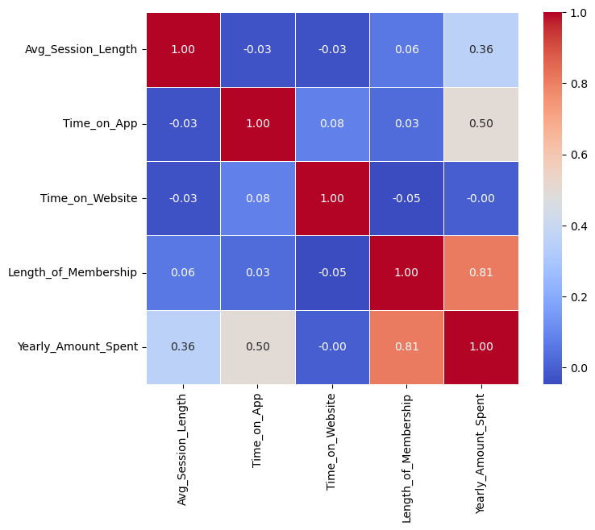
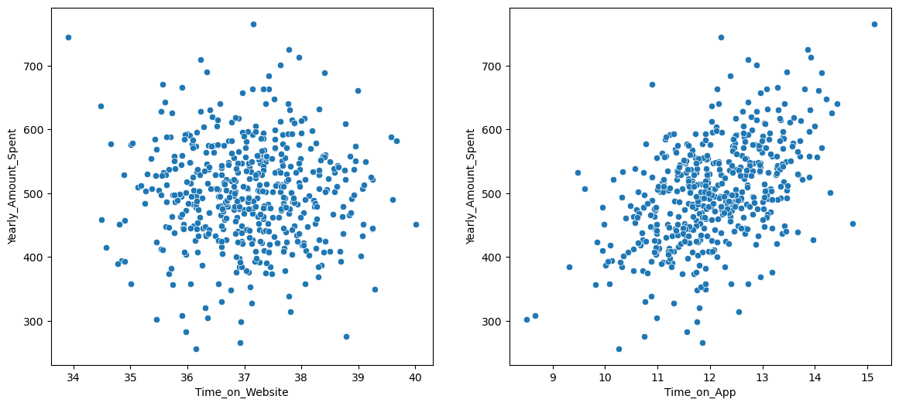
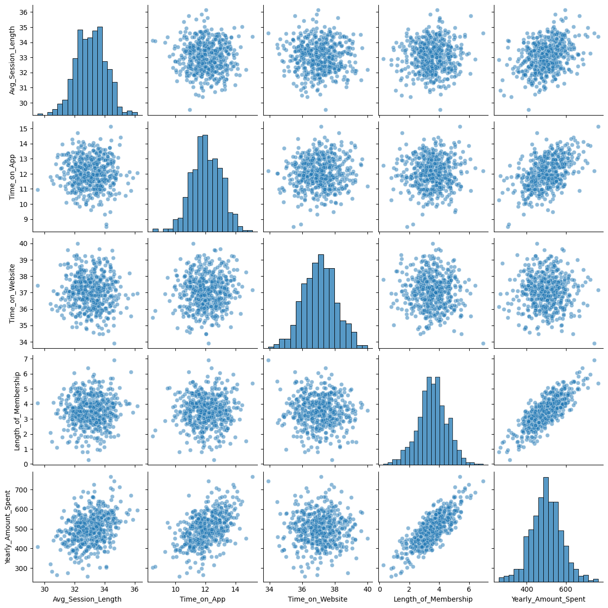
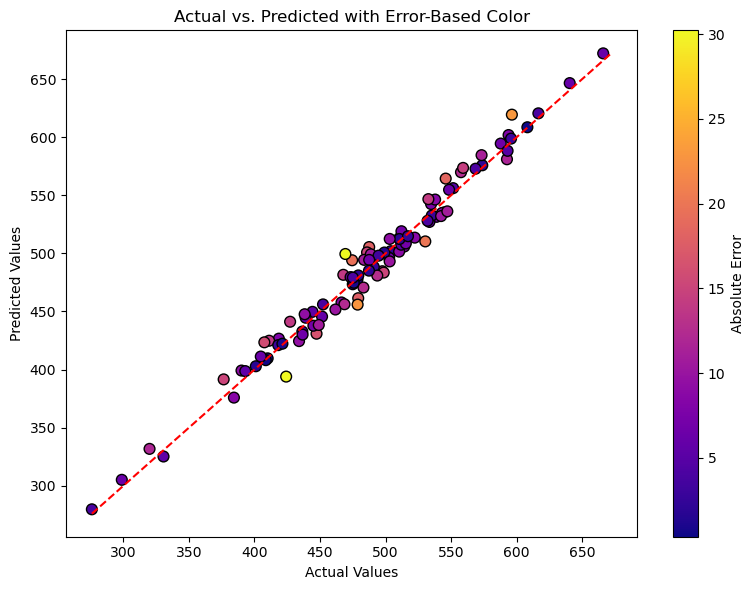
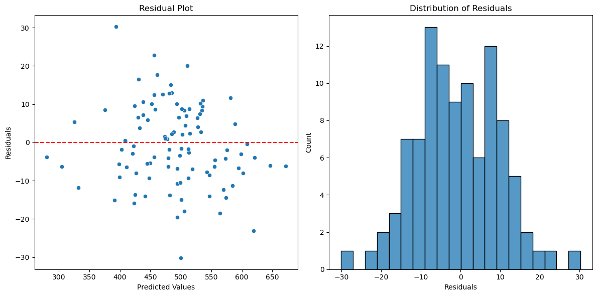

```python
import pandas as pd
import numpy as np
import matplotlib.pyplot as plt
import seaborn as sns
```

## Loading Dataset


```python
df = pd.read_csv('./customers_dataset.csv')

df.head()
```


<div>
<style scoped>
    .dataframe tbody tr th:only-of-type {
        vertical-align: middle;
    }

    .dataframe tbody tr th {
        vertical-align: top;
    }

    .dataframe thead th {
        text-align: right;
    }
</style>
<table border="1" class="dataframe">
  <thead>
    <tr style="text-align: right;">
      <th></th>
      <th>Email</th>
      <th>Address</th>
      <th>Avatar</th>
      <th>Avg. Session Length</th>
      <th>Time on App</th>
      <th>Time on Website</th>
      <th>Length of Membership</th>
      <th>Yearly Amount Spent</th>
    </tr>
  </thead>
  <tbody>
    <tr>
      <th>0</th>
      <td>mstephenson@fernandez.com</td>
      <td>835 Frank Tunnel\nWrightmouth, MI 82180-9605</td>
      <td>Violet</td>
      <td>34.497268</td>
      <td>12.655651</td>
      <td>39.577668</td>
      <td>4.082621</td>
      <td>587.951054</td>
    </tr>
    <tr>
      <th>1</th>
      <td>hduke@hotmail.com</td>
      <td>4547 Archer Common\nDiazchester, CA 06566-8576</td>
      <td>DarkGreen</td>
      <td>31.926272</td>
      <td>11.109461</td>
      <td>37.268959</td>
      <td>2.664034</td>
      <td>392.204933</td>
    </tr>
    <tr>
      <th>2</th>
      <td>pallen@yahoo.com</td>
      <td>24645 Valerie Unions Suite 582\nCobbborough, D...</td>
      <td>Bisque</td>
      <td>33.000915</td>
      <td>11.330278</td>
      <td>37.110597</td>
      <td>4.104543</td>
      <td>487.547505</td>
    </tr>
    <tr>
      <th>3</th>
      <td>riverarebecca@gmail.com</td>
      <td>1414 David Throughway\nPort Jason, OH 22070-1220</td>
      <td>SaddleBrown</td>
      <td>34.305557</td>
      <td>13.717514</td>
      <td>36.721283</td>
      <td>3.120179</td>
      <td>581.852344</td>
    </tr>
    <tr>
      <th>4</th>
      <td>mstephens@davidson-herman.com</td>
      <td>14023 Rodriguez Passage\nPort Jacobville, PR 3...</td>
      <td>MediumAquaMarine</td>
      <td>33.330673</td>
      <td>12.795189</td>
      <td>37.536653</td>
      <td>4.446308</td>
      <td>599.406092</td>
    </tr>
  </tbody>
</table>
</div>


## Quick overview of our data


```python
df.info()
```

    <class 'pandas.core.frame.DataFrame'>
    RangeIndex: 500 entries, 0 to 499
    Data columns (total 8 columns):
     #   Column                Non-Null Count  Dtype  
    ---  ------                --------------  -----  
     0   Email                 500 non-null    object 
     1   Address               500 non-null    object 
     2   Avatar                500 non-null    object 
     3   Avg. Session Length   500 non-null    float64
     4   Time on App           500 non-null    float64
     5   Time on Website       500 non-null    float64
     6   Length of Membership  500 non-null    float64
     7   Yearly Amount Spent   500 non-null    float64
    dtypes: float64(5), object(3)
    memory usage: 31.4+ KB
    


```python
df.select_dtypes(include="object").describe()
```


<div>
<style scoped>
    .dataframe tbody tr th:only-of-type {
        vertical-align: middle;
    }

    .dataframe tbody tr th {
        vertical-align: top;
    }

    .dataframe thead th {
        text-align: right;
    }
</style>
<table border="1" class="dataframe">
  <thead>
    <tr style="text-align: right;">
      <th></th>
      <th>Email</th>
      <th>Address</th>
      <th>Avatar</th>
    </tr>
  </thead>
  <tbody>
    <tr>
      <th>count</th>
      <td>500</td>
      <td>500</td>
      <td>500</td>
    </tr>
    <tr>
      <th>unique</th>
      <td>500</td>
      <td>500</td>
      <td>138</td>
    </tr>
    <tr>
      <th>top</th>
      <td>mstephenson@fernandez.com</td>
      <td>835 Frank Tunnel\nWrightmouth, MI 82180-9605</td>
      <td>SlateBlue</td>
    </tr>
    <tr>
      <th>freq</th>
      <td>1</td>
      <td>1</td>
      <td>7</td>
    </tr>
  </tbody>
</table>
</div>


```python
df.describe()
```


<div>
<style scoped>
    .dataframe tbody tr th:only-of-type {
        vertical-align: middle;
    }

    .dataframe tbody tr th {
        vertical-align: top;
    }

    .dataframe thead th {
        text-align: right;
    }
</style>
<table border="1" class="dataframe">
  <thead>
    <tr style="text-align: right;">
      <th></th>
      <th>Avg. Session Length</th>
      <th>Time on App</th>
      <th>Time on Website</th>
      <th>Length of Membership</th>
      <th>Yearly Amount Spent</th>
    </tr>
  </thead>
  <tbody>
    <tr>
      <th>count</th>
      <td>500.000000</td>
      <td>500.000000</td>
      <td>500.000000</td>
      <td>500.000000</td>
      <td>500.000000</td>
    </tr>
    <tr>
      <th>mean</th>
      <td>33.053194</td>
      <td>12.052488</td>
      <td>37.060445</td>
      <td>3.533462</td>
      <td>499.314038</td>
    </tr>
    <tr>
      <th>std</th>
      <td>0.992563</td>
      <td>0.994216</td>
      <td>1.010489</td>
      <td>0.999278</td>
      <td>79.314782</td>
    </tr>
    <tr>
      <th>min</th>
      <td>29.532429</td>
      <td>8.508152</td>
      <td>33.913847</td>
      <td>0.269901</td>
      <td>256.670582</td>
    </tr>
    <tr>
      <th>25%</th>
      <td>32.341822</td>
      <td>11.388153</td>
      <td>36.349257</td>
      <td>2.930450</td>
      <td>445.038277</td>
    </tr>
    <tr>
      <th>50%</th>
      <td>33.082008</td>
      <td>11.983231</td>
      <td>37.069367</td>
      <td>3.533975</td>
      <td>498.887875</td>
    </tr>
    <tr>
      <th>75%</th>
      <td>33.711985</td>
      <td>12.753850</td>
      <td>37.716432</td>
      <td>4.126502</td>
      <td>549.313828</td>
    </tr>
    <tr>
      <th>max</th>
      <td>36.139662</td>
      <td>15.126994</td>
      <td>40.005182</td>
      <td>6.922689</td>
      <td>765.518462</td>
    </tr>
  </tbody>
</table>
</div>


### Clean columns' names from any spaces


```python
df.columns = df.columns.str.replace(" ",  "_").str.replace(".", "")
```


```python
df.columns
```


    Index(['Email', 'Address', 'Avatar', 'Avg_Session_Length', 'Time_on_App',
           'Time_on_Website', 'Length_of_Membership', 'Yearly_Amount_Spent'],
          dtype='object')


## Correlation HeatMap & Charts


```python
corr = df.corr(numeric_only=True)


plt.figure(figsize=(8,6))
sns.heatmap(corr, annot=True, fmt=".2f", cmap="coolwarm", square=True, linewidths=0.5)
plt.show()
```


    

    


```python
df.columns
```


    Index(['Email', 'Address', 'Avatar', 'Avg_Session_Length', 'Time_on_App',
           'Time_on_Website', 'Length_of_Membership', 'Yearly_Amount_Spent'],
          dtype='object')


```python
fig, (ax1, ax2) = plt.subplots(1,2, figsize=(14,6))

sns.scatterplot(data=df, x="Time_on_Website", y="Yearly_Amount_Spent", ax=ax1)
sns.scatterplot(data=df, x="Time_on_App", y="Yearly_Amount_Spent", ax=ax2)

plt.show()
```


    

    


```python
sns.pairplot(df, kind="scatter", plot_kws={"alpha": 0.5})

plt.show()
```


    

    


## Feature Selection


```python
from sklearn.model_selection import train_test_split
```


```python
X = df[['Avg_Session_Length', 'Time_on_App', 'Time_on_Website', 'Length_of_Membership']]
y = df["Yearly_Amount_Spent"]
```


```python
X_train, X_test, y_train, y_test = train_test_split(X, y, test_size=0.2, random_state=42)
```


```python
X_train.head()
```


<div>
<style scoped>
    .dataframe tbody tr th:only-of-type {
        vertical-align: middle;
    }

    .dataframe tbody tr th {
        vertical-align: top;
    }

    .dataframe thead th {
        text-align: right;
    }
</style>
<table border="1" class="dataframe">
  <thead>
    <tr style="text-align: right;">
      <th></th>
      <th>Avg_Session_Length</th>
      <th>Time_on_App</th>
      <th>Time_on_Website</th>
      <th>Length_of_Membership</th>
    </tr>
  </thead>
  <tbody>
    <tr>
      <th>249</th>
      <td>33.780157</td>
      <td>11.917636</td>
      <td>36.844734</td>
      <td>3.634996</td>
    </tr>
    <tr>
      <th>433</th>
      <td>34.278248</td>
      <td>11.822722</td>
      <td>36.308545</td>
      <td>2.117383</td>
    </tr>
    <tr>
      <th>19</th>
      <td>32.617856</td>
      <td>13.989593</td>
      <td>37.190504</td>
      <td>4.064549</td>
    </tr>
    <tr>
      <th>322</th>
      <td>33.264632</td>
      <td>10.732131</td>
      <td>36.145792</td>
      <td>4.086566</td>
    </tr>
    <tr>
      <th>332</th>
      <td>33.144234</td>
      <td>11.737041</td>
      <td>37.935189</td>
      <td>2.190132</td>
    </tr>
  </tbody>
</table>
</div>


## Training The Model


```python
from sklearn.linear_model import LinearRegression

model = LinearRegression()
model.fit(X_train, y_train)

print("coefficients:", model.coef_)
print("interception:", model.intercept_)

predictions = model.predict(X_test)
print("Predicted Yearly_Amount_Spent:", predictions[:10])
```

    coefficients: [25.5962591  38.78534598  0.31038593 61.89682859]
    interception: -1044.2574146365575
    Predicted Yearly_Amount_Spent: [402.86230051 542.53325708 426.62011918 501.91386363 409.6666551
     569.92155038 531.50423529 505.94309188 408.10378607 473.45942928]
    

## Difference between Predicted and Actual Values


```python
actual_vs_predicted = {
    "Actual_Yearly_Spent": y_test,
    "Predicted_Yearly_Spent": predictions
}

actual_vs_predicted_df = pd.DataFrame(actual_vs_predicted)
actual_vs_predicted_df["Difference"] = np.abs(round(actual_vs_predicted_df["Predicted_Yearly_Spent"] - actual_vs_predicted_df["Actual_Yearly_Spent"], 2))

actual_vs_predicted_df.sort_values(by="Difference", ascending=False).head()
```


<div>
<style scoped>
    .dataframe tbody tr th:only-of-type {
        vertical-align: middle;
    }

    .dataframe tbody tr th {
        vertical-align: top;
    }

    .dataframe thead th {
        text-align: right;
    }
</style>
<table border="1" class="dataframe">
  <thead>
    <tr style="text-align: right;">
      <th></th>
      <th>Actual_Yearly_Spent</th>
      <th>Predicted_Yearly_Spent</th>
      <th>Difference</th>
    </tr>
  </thead>
  <tbody>
    <tr>
      <th>148</th>
      <td>424.185494</td>
      <td>393.955933</td>
      <td>30.23</td>
    </tr>
    <tr>
      <th>472</th>
      <td>469.383146</td>
      <td>499.506960</td>
      <td>30.12</td>
    </tr>
    <tr>
      <th>82</th>
      <td>596.430173</td>
      <td>619.465550</td>
      <td>23.04</td>
    </tr>
    <tr>
      <th>75</th>
      <td>478.719357</td>
      <td>455.930701</td>
      <td>22.79</td>
    </tr>
    <tr>
      <th>278</th>
      <td>530.362469</td>
      <td>510.339492</td>
      <td>20.02</td>
    </tr>
  </tbody>
</table>
</div>


## Vusialization


```python
plt.figure(figsize=(8, 6))
scatter = plt.scatter(
    actual_vs_predicted_df["Actual_Yearly_Spent"], 
    actual_vs_predicted_df["Predicted_Yearly_Spent"],
    c=actual_vs_predicted_df["Difference"], 
    cmap="plasma", 
    s=60, 
    edgecolor="k"
)

# Add diagonal line (perfect prediction line)
min_val = min(actual_vs_predicted_df["Actual_Yearly_Spent"].min(), actual_vs_predicted_df["Predicted_Yearly_Spent"].min())
max_val = max(actual_vs_predicted_df["Actual_Yearly_Spent"].max(), actual_vs_predicted_df["Predicted_Yearly_Spent"].max())
plt.plot([min_val, max_val], [min_val, max_val], 'r--')

plt.xlabel("Actual Values")
plt.ylabel("Predicted Values")
plt.title("Actual vs. Predicted with Error-Based Color")
plt.colorbar(scatter, label="Absolute Error")
plt.tight_layout()
plt.show()
```


    

    


```python
residuals = y_test - predictions

fig, (ax1, ax2) = plt.subplots(1,2, figsize=(12,6))

sns.scatterplot(x=predictions, y=residuals, ax=ax1)
ax1.axhline(0, color='red', linestyle='--')
ax1.set_xlabel("Predicted Values")
ax1.set_ylabel("Residuals")
ax1.set_title("Residual Plot")

sns.histplot(residuals, bins=20, ax=ax2)
ax2.set_xlabel("Residuals")
ax2.set_title("Distribution of Residuals")

plt.tight_layout()
plt.show()
```


    

    


## Model Evaluation


```python
from sklearn.metrics import mean_absolute_error, mean_squared_error, r2_score

mae = mean_absolute_error(y_test, predictions)
mse = mean_squared_error(y_test, predictions)
rmse = np.sqrt(mse)
r2 = r2_score(y_test, predictions)

# საზომების ბეჭდვა
print(f"Mean Absolute Error (MAE): {mae}")
print(f"Mean Squared Error (MSE): {mse}")
print(f"Root Mean Square Error (RMSE): {rmse}")
print(f"Determination coefficient (R²): {r2}")
```

    Mean Absolute Error (MAE): 8.558441885315233
    Mean Squared Error (MSE): 109.86374118393988
    Root Mean Square Error (RMSE): 10.48159058463647
    Determination coefficient (R²): 0.9778130629184127
    
